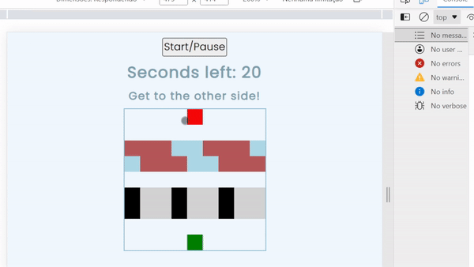

#### Frogger game made with vanilla JavaScript, HTML and CSS
###### 🚩v _Frogger feito com JS básico, HTML e CSS_

If you hit either the black blocks (cars) or the lightblue ones (river) you'll lose. The frog will move along with the logs if you stand on them.

 🚩 _Se você acertar os blocos pretos (carros) ou os azuis-claros (rio) você perderá. O sapo será movido junto com a madeira se você ficar em cima dela._

Project made following Ania Kubow's JS game guide. This was made solely for the purpose of practicing JavaScript. 
	
 🚩 _Projeto feito seguindo o guia de jogos feitos com JavsScript de Ania Kubow. Feito somente para praticar JavaScript._

